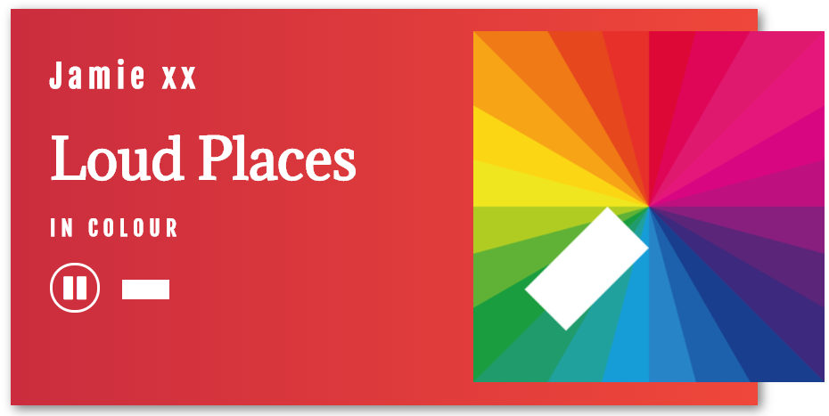

[spotify-playlist-player](https://omguhh.github.io/spotify-playlist-player/)
=========

A simple player built with React.



### TODO

1) Stream a spotify playlist
2) Display list of upcoming songs
3) Add functionality to skip/repeat songs

### Development

- Clone the repo:
```
git clone https://github.com/omguhh/spotify-playlist-player.git
```

- Go to the project directory and install dependencies: 
```
cd spotify-playlist-player && npm install
```

- Run `npm start` to show the application window with your current build.